# voice-learn

## Idea

- The idea of this app is to learn out aloud, a popular technique called Feynman that helps us to learn anything and explain it in simpler terms.
- The technique follows a 4 step mental model,
  - Select a topic and write down whatever knowledge you have
  - Explain it to a 12 year old avoiding jargons and if you can't explain then you've not understood fully
  - Identify the gaps, refine them with a good explanation and get a deeper understanding

## Motive

The traditional way used pen and paper techinque writing down topics, identifying gaps, refining explanation. But we could use voice AI to allow anyone to speak out their learning, analyse the gaps and gather a deeper understanding on their subject.

## How to achieve the idea

- Have a voice AI model that captures users voice recording, analyse their explanation, provide gaps and strengths. This solves the identifying gaps step.
- Generate flash card questions related to the weaker gap points. This solves the knowledge refinement problem.
- Enforce this as a habit by allowing streak based learning, review type flash cards, insights on their learning.

## Functional requirements

- Ability to record voice and speak their learning. For now let's allow 10mins per record, 30mins max for a day.
- Ability to select a topic, difficulty level and record their learning.
- Ability to view transcripts, recording, strengths, gap points, followup questions, score (out of 10) post recording of voice session **(Agentic AI Pipeline)**
- Ability to generate flash cards for recorded learnings specifically focusing on weaker or gap points.
- Ability to review generated flash cards and refine their scores back.
- Ability to view flash cards on a spaced reptition algorithm. (If you score low on a flashcard, it will show up more often so you can practice the weaker concepts. If you score high, it will appear less often. This way, difficult topics come up frequently, while well-known cards come back only once in a while to help you remember them for long-term)
- Ability to chat with their learnings and ask anything **(RAG)**
- Ability to view insights such as Topics learned (with avg scores on each), strongest topic learned with it's score, weaker topics that needs an improvement.
- Ability to view their streak, activity heatmap **(UI / UX needs to addressed later)**

## Non-functional requirements

- Rate limiting per session, per day on an account basis.
- Eventual consistency for insights, streak count, and any other stats.
- System should be highly available
- Latency for AI Analysis for a topic should be less than 3s for now. Later this should even be reduced to < 2s
- Accuracy for the speech to text should be an industry standard

## UI / UX Scenarios

- **Login, Signup**: Creating an account, logging in to the voice learn app
- **Dashboard / Home**: Post login, in the dashboard screen user could review their flash cards, see their recent 5 to 7 explanations with each explanation displayed as a card
- **Library**: List of all their explanations, each explanation has it's audio recording, transcripts, strengths, weaker gap points, follow up questions with AI Generated answers, auto generated flashcards
- **Flashcards**: List of auto generated flashcards for their learning sessions, review them and get scores.
- **Insights**: Insights such as list of topics learned with avg score of each, strongest topic, weaker topic learned and needs improvement.
- **Settings**: Update profile name, profile avatar.

## Screenshots

1. Onboarding Page

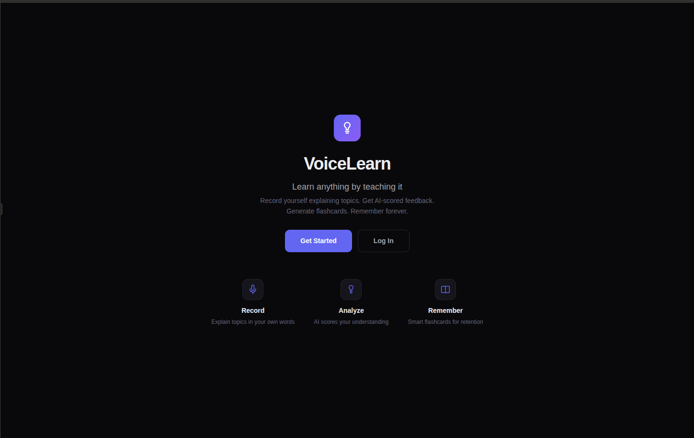

2. Login / Signup

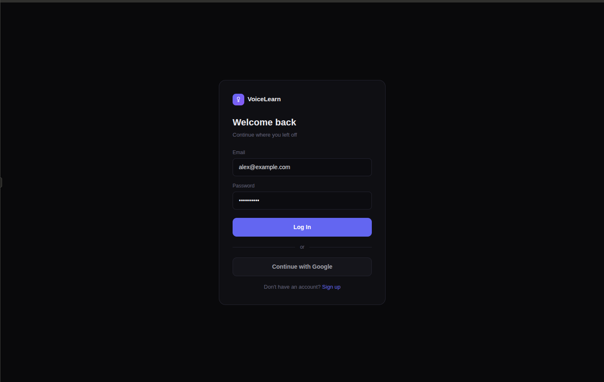
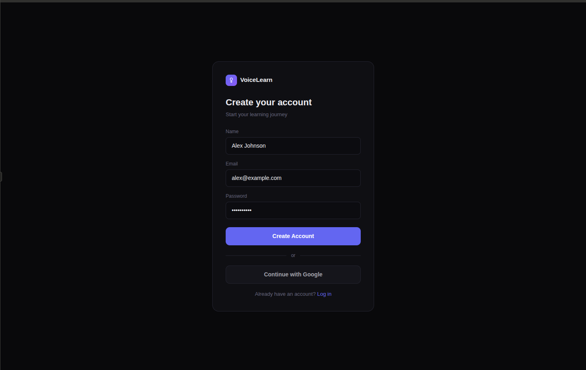

3. Home page

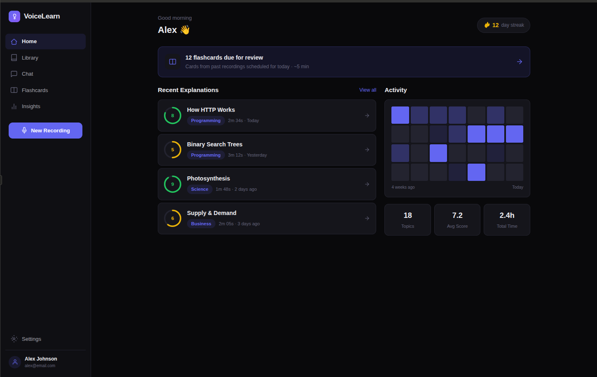

4. Explanation card details

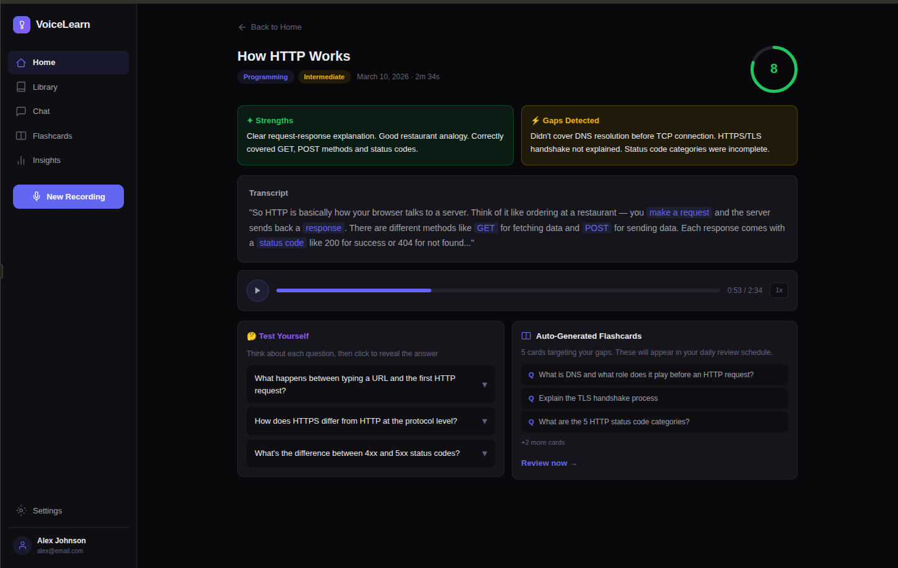

5. Library page

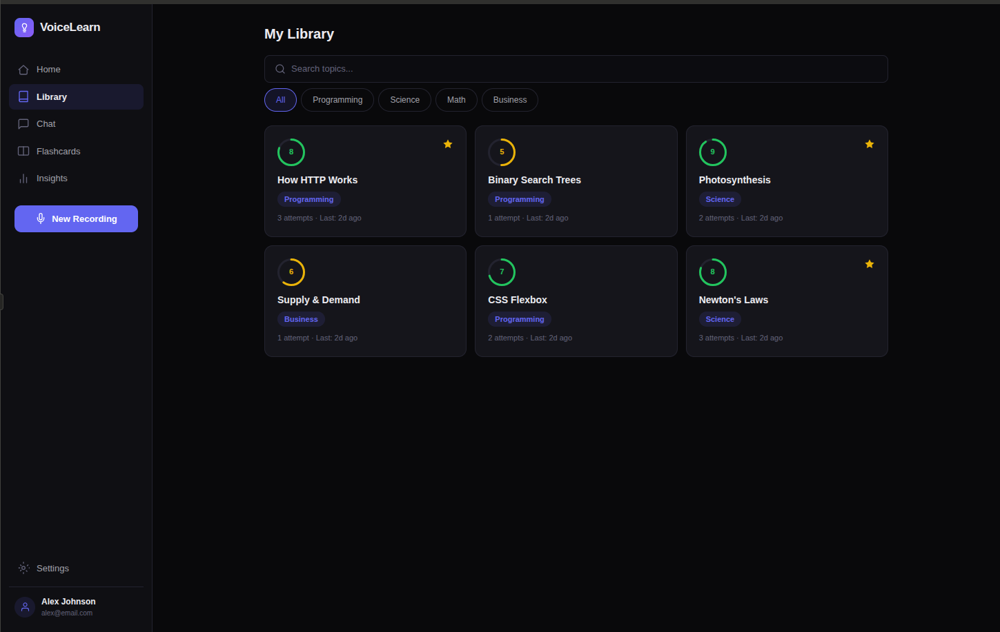

6. Flashcards page (the stats at the top of this page should be reviewed in the design to decide if it's needed or not)

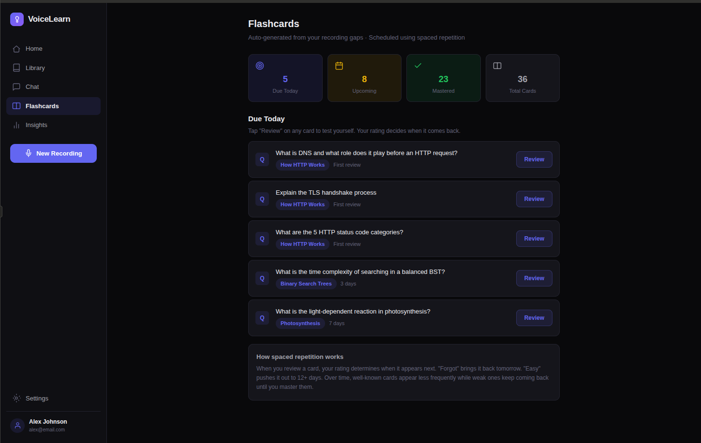

7. Review flashcards page

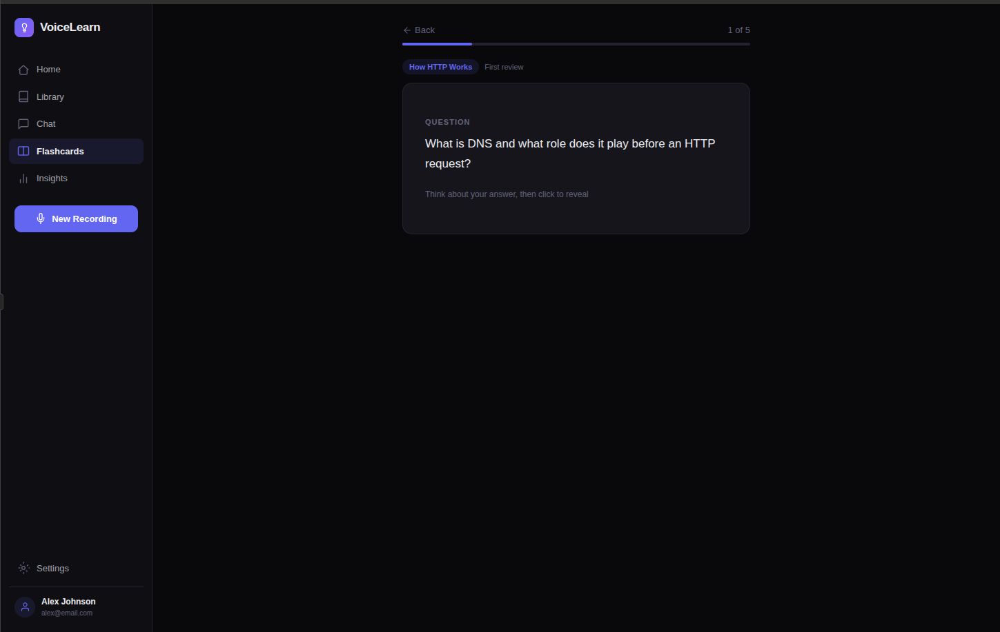

8. Insights page

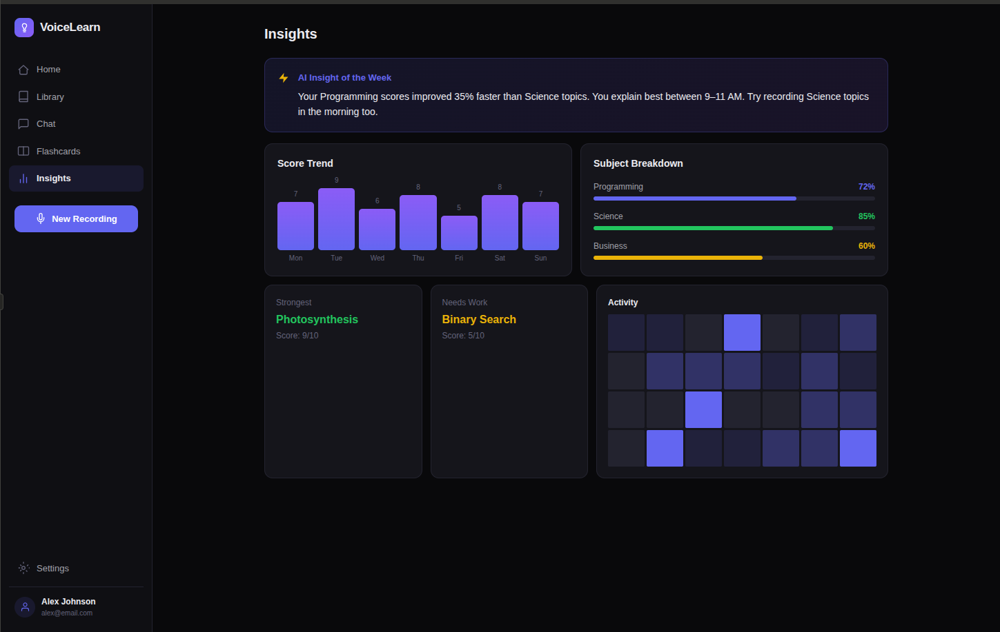

9. New recording start page

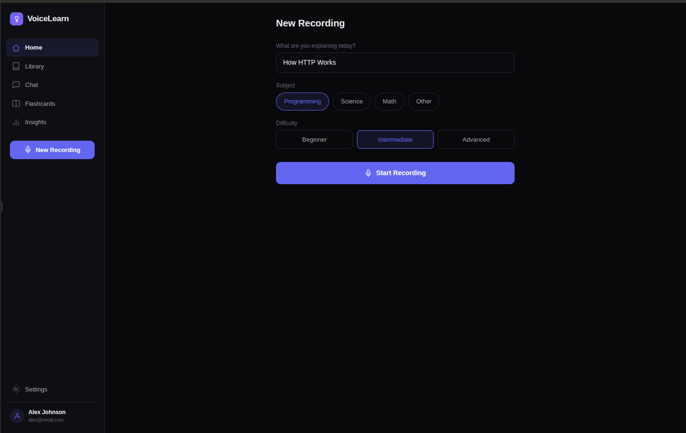

10. In progress voice recording session page

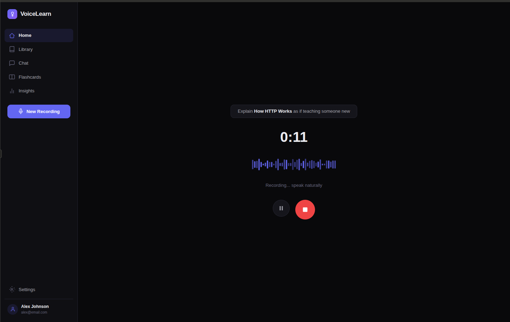

11. AI Analysis page post voice record session

